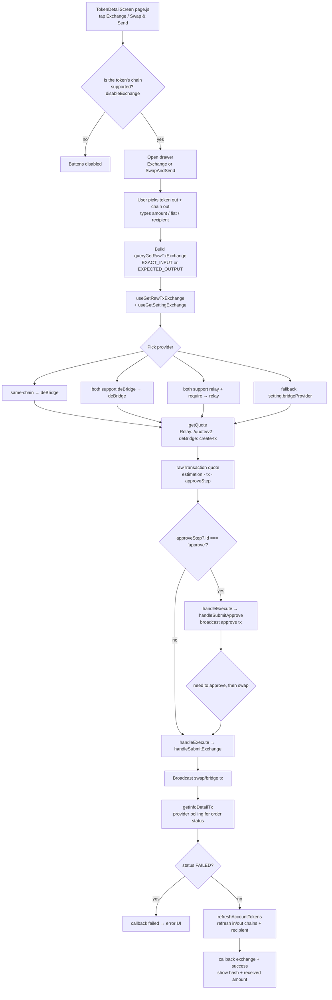

# Swap / Bridge — the full "Exchange" flow

> Code lives in: `src/Frontend/Screen/TokenDetailScreen/` (+ the quote hook in `src/Frontend/Hooks/useGetRawTxExchange.js`)

This doc covers **the whole exchange flow end-to-end**: from tapping "Exchange" on a token's detail screen, through entering amounts and picking a destination chain/token, to signing the approval + swap transactions, tracking them, and refreshing balances. How a quote itself is fetched lives in `src/Frontend/Hooks/useGetRawTxExchange.js`.

---

## 1. In plain English

"Exchange" is Keyring's name for **swap (same chain) and bridge (cross chain)**. It is powered by two external providers — **Relay** and **deBridge** — and exposed to the user through two entry points that share the exact same engine:

| Entry point | What the user does | Screen |
|-------------|--------------------|--------|
| **Exchange** (`Initial.exchange`) | Sell token A on chain X for token B, optionally on chain Y | `Component/Exchange/` |
| **Swap & Send** (`v2.swapAndSend.title`) | Same, but send the result to **any address** (own wallet, another wallet, an address-book contact) | `Component/SwapAndSend/` + `Component/SwapAndSendSubmit/` |

From the user's point of view the flow is:

1. Pick **what to sell** (token in, amount, optionally a fiat amount) and **what to buy** (token out + destination chain).
2. The app asks the chosen provider for a **quote** (live every 10 seconds) — how much you get out, the fees, and the exact raw transaction bytes to broadcast.
3. User reviews on a **Confirm** screen (amounts, USD, price impact, slippage, gas).
4. If the token needs approval first, the app broadcasts an **ERC-20 `approve`** tx.
5. The app broadcasts the **swap/bridge** tx, then **polls the provider** until it reports the order is done.
6. Balances are refreshed so the wallet reflects the new amounts.

Under the hood the flow is split into four layers:

```
TokenDetailScreen (BaseContainer — owns all state)
        │  opens drawers
        ▼
Exchange / SwapAndSendSubmit (UI + local state + input validation)
        │  builds the quote request, calls the hook
        ▼
useGetRawTxExchange (quote)  ──►  useGetSettingExchange (settings/cache)
        │  via SwapServiceFactory
        ▼
RelayAdapter / DebridgeAdapter  ──►  AllChainServices + ViemWeb3 (sign & broadcast)
```

---

## 2. The big picture (diagram)



---

## 3. What happens, step by step

### Step 1 — Entry: where the buttons come from

`src/Frontend/Screen/TokenDetailScreen/page.js` renders the three token operations (Send, Swap & Send, Exchange). The two exchange operations are gated by `disableExchange`:

```js
const disableExchange = useMemo(() => {
  if (getAllChain().length > 0) {
    const isSupportChain = getAllChain()?.some(chain =>
      chain?.chainId?.toString() === display?.chainId?.toString()
    )
    if (isSupportChain) return false
  }
  return true
}, [settingExchange, display])
```

`getAllChain()` comes from `useGetSettingExchange` — it returns only the chains the **default** provider supports (plus any chain on a provider's `requireChain` list). So if the token's own chain isn't exchange-supported, the buttons stay disabled. They are also disabled for view-only accounts (`isViewOnly`).

Tapping the row calls `onExchange()` / `onSwapAndSend()` on the screen class, which just opens a drawer:

```js
onExchange = () => {
  this.openDrawer({ children: <Exchange _this={this} /> })
}
```

### Step 2 — Where all state lives

`TokenDetailScreen` is a `BaseContainer`. It holds two state slices that mirror the two entry points:

```js
INIT_STATE = {
  exchange:   { tokenIn: null, tokenOut: null, chainOut: null, amountIn: '', amountIn2USD: '', amountOut: '', amountOut2USD: '' },
  swapAndSend: { tokenIn: null, tokenOut: null, chainOut: null, amountIn: '', ..., recipientAddress: '' }
}
```

- `tokenIn` is seeded from the token detail screen (`page.js` pushes `{ ...token, ...display }` into both slices).
- All updates flow through `onChangeValueExchange(data, isExchange)` (`isExchange` selects which slice).
- When the user switches token-out/chain-out in the sub-drawers, `handleSelectChain` / `handleSelectTokenOut` close the sub-drawer and re-open the main one.

### Step 3 — Entering the swap (the Exchange drawer)

`Component/Exchange/index.js` is the main UI. Key local state:

| State | Purpose |
|-------|---------|
| `amountIn` / `amountOut` | The two token amounts |
| `isExactInput` | `true` = user typed input (quote computes output) · `false` = user typed output (quote computes input) |
| `isUsdInEdited` | `true` = the fiat field was typed by hand (kept verbatim, no round-trip) |
| `slippage` | default `1` (%), user picks from `[0.5, 1, 2, 3]` on Confirm |
| `tableView` | `'enterExchange'` or `'confirmExchange'` |
| `step` / `hash` / `requestId` | Execution timeline (see Step 8) |
| `hasStartedExecute` | Flips `true` the instant the user taps Approve/Execute → freezes the quote |

Addresses are normalized up front: native tokens become `zeroAddress` (or the chain's special native address via `getAddressNative`), everything else is lowercased:

```js
const addressTokenIn = useMemo(() => {
  let addressIn = tokenIn?.contractAddress === 'native' ? zeroAddress : lowerCase(tokenIn?.contractAddress)
  if (isNativeToken(addressIn, tokenIn?.chainId)) addressIn = getAddressNative(tokenIn?.chainId, addressIn)
  return addressIn
}, [tokenIn])
```

A handful of hooks keep the inputs honest: `useGetDecimalToken` (decimals for each side), `useGasPrice`, `useGetBalanceToken` (token in + native balance), `useGetTokenPrice` (USD values, polled every 10 s to match the quote).

### Step 4 — Building the quote request

Both the Exchange drawer and `SwapAndSendSubmit` build a memoized `queryGetRawTxExchange` object. It returns `null` when there is nothing to ask for (no token out yet, decimals still loading, amount `<= 0`, or same token + same chain), which disables the query:

```js
const queryGetRawTxExchange = useMemo(() => {
  if (tokenOut && !loadingDecimalTokenIn && !loadingDecimalTokenOut) {
    if (lowerCase(addressTokenIn) === lowerCase(addressTokenOut) && !isCrossChain) return null
    if (amountInDebounce && isExactInput) {
      if (!BigNumber(amountInDebounce).gt(0)) return null
      return {
        srcChainId: tokenIn?.chainId,
        srcTokenAddress: addressTokenIn,
        srcTokenAmount: convertBalanceToWei(amountInDebounce, decimalTokenIn),
        dstChainId: chainIdOut,
        dstTokenAddress: addressTokenOut,
        recipientAddress: account?.address,
        slippage,
        senderAddress: account?.address,
        tradeType: 'EXACT_INPUT'
      }
    }
    // ...else EXPECTED_OUTPUT branch (amount is the OUTPUT amount, uses OUT decimals)
  }
  return null
}, [deps...])
```

Notes:
- The input amount is debounced 500 ms (`useDebounceValue`) so the quote API isn't hammered per keystroke.
- Only the field the user is actively editing drives the query (`amountInDebounce` when `isExactInput`, `amountOutDebounce` otherwise).
- For `EXPECTED_OUTPUT`, `srcTokenAmount` is the desired OUTPUT amount and uses the **out** token decimals — the provider works backwards to the required input.
- ⚠️ **Keep this memoized.** If its reference changes every render, the hook re-fetches a quote on every render.

### Step 5 — The quote hook + settings (see the swap doc for the deep dive)

```js
const isExecuting =
  hasStartedExecute || loadingApprove || loadingExchange ||
  step != null || !!hash?.approve || !!hash?.exchange

const { bridgeProvider, data: rawTransaction, isLoading: loadingGetQuote } =
  useGetRawTxExchange(queryGetRawTxExchange, { freeze: isExecuting })
```

`useGetRawTxExchange` (`src/Frontend/Hooks/useGetRawTxExchange.js`) does three things:

1. Loads the settings via `useGetSettingExchange` (fetched from the Exchange API + the two providers' chain lists; cached only in a session-scoped variable `chainSupportSession`, no AsyncStorage persistence — fresh fetch on every cold start).
2. **Picks the provider per swap** in this priority order:
   1. same chain → **deBridge**
   2. both chains support deBridge → **deBridge**
   3. both chains support Relay AND at least one is on Relay's `requireChain` list → **Relay**
   4. otherwise → `setting.bridgeProvider` (default `relay`)
3. Runs React Query with `enabled: !!filterData && !freeze && !!bridgeProvider`, `refetchInterval: freeze ? false : 10000`, `refetchOnWindowFocus: !freeze`, `refetchOnReconnect: !freeze`.

`getData` then calls `SwapServiceFactory.getService(bridgeProvider)` (cached per provider) and `swapService.getQuote(quoteParams)`. Returns the full quote on success, `{ error, errorMessage }` when the provider refuses, or `[]` if something crashes.

> ⚠️ `data` can be `[]` on a crash — never assume it's always an object or `null`.

### Step 6 — Rendering the quote back into the form

When `rawTransaction.estimation` arrives, a `useEffect` fills the **other** amount:

- `isExactInput` → read `estimation.dstChainTokenOut.amount` (wei) → convert → set `amountOut`.
- else → read `estimation.srcChainTokenIn.amount` → set `amountIn` (and recompute the fiat field).

Validation (`useEffect` on the inputs + quote):
- Same token on same chain → `ExchangeScreen.sameTokenError`.
- Provider error → `rawTransaction.errorMessage`.
- Native token → balance minus estimated gas must cover the amount.
- Non-native → native balance must cover gas, token balance must cover amount.
- Gas estimate (`estimateFake`) = `gasPrice × DEFAULT_GAS_LIMIT (1,000,000)` plus deBridge's fixed cross-chain fee (`FEE_PLATFORM_EXCHANGE_FIXED.deBridge = '0.001'`) when cross-chain.

### Step 7 — Confirm screen + slippage

`renderConfirm()` shows both token rows with USD (`amountInUsdForDisplay` / `amountOutUsd` — **computed from our own price API**, not the provider's `amountUsd`), the **price impact** `% = (out − in) / in × 100`, the rate line, an estimated gas `< $X`, and the slippage picker. The slippage buttons are disabled while `isExecuting` because the quote is frozen and changing slippage would do nothing.

The Confirm button (and the Enter button) only enables when `rawTransaction?.tx` exists — i.e. a real executable quote is on screen.

### Step 8 — Execution: `handleExecute`

`handleExecute` in `Exchange/index.js` (and mirrored in `SwapAndSendSubmit`) is where things get committed:

```js
const handleExecute = async () => {
  Keyboard.dismiss()
  setHasStartedExecute(true) // freeze the quote, synchronously, before any await
  if (isHasApprove && !hash?.approve) {
    // 1) Broadcast the approval first
    const rawApprove = rawTransaction?.approveStep?.items[0]?.data
    const raw = { data: rawApprove.data, to: rawApprove.to, from: rawApprove.from || account.address, noEstimateGas: true }
    if (rawApprove?.gas) raw.gasLimit = rawApprove.gas
    else raw.gasLimit = DEFAULT_GAS_LIMIT
    if (rawApprove.value && BigNumber(rawApprove.value.toString()).gt(0)) { raw.value = rawApprove.value; raw.valueNoConvert = rawApprove.value }
    await handleSubmitApprove(raw, callbackStep, true)
  } else {
    // 2) Broadcast the swap/bridge tx
    const raw = { data: rawTransaction?.tx.data, to: rawTransaction?.tx.to, from: rawTransaction?.tx.from || account.address, noEstimateGas: true, rawTransactionApi: rawTransaction?.tx }
    if (rawTransaction?.tx?.gas) raw.gasLimit = rawTransaction?.tx.gas
    else raw.gasLimit = DEFAULT_GAS_LIMIT
    if (rawTransaction?.tx.value && BigNumber(rawTransaction?.tx.value.toString()).gt(0)) { raw.value = rawTransaction?.tx.value; raw.valueNoConvert = rawTransaction?.tx.value }
    if (rawTransaction?.rawResponse?.requestId) raw.requestId = rawTransaction?.rawResponse?.requestId
    await handleSubmitExchange(raw, rawTransaction.provider, callbackStep)
  }
}
```

Key details:
- `noEstimateGas: true` because the provider already returns a `gas` (or we fall back to `DEFAULT_GAS_LIMIT`) — the app does not re-estimate the raw swap tx.
- `valueNoConvert` keeps the raw value string (already in wei) so the signing layer doesn't convert it.
- Relay exposes `rawResponse.requestId` (the intent id), which is forwarded so Relay can later look the order up.
- `isHasApprove` is `rawTransaction?.approveStep?.id === 'approve'`. Relay returns an approve step when one is needed; deBridge generates one via `generateTxApprove` (an on-chain `allowance()` check).

### Step 9 — Signing & broadcasting (`TokenDetailScreen`)

Both submit methods follow the same private-key pattern: **NFC card accounts** pull the key from the card via `this.nfcProxy.getPrivateKeyFromNFC(address)` (returns nothing if the user cancels → `approveFailed`/`failed`), everything else reads it from **Secure Storage** via `getPrivateKeyByAddress`. `remove0xFromPrivateKey` strips the `0x`. **Never log the key.**

**`handleSubmitApprove(raw, callback, stateSource)`**:

```js
callback(STEP_EXCHANGE.approving)
// ...get private key...
const hash = await AllChainServices.postBaseSendTxsForSwap(chainId, privateKey, rawTransaction)
callback(STEP_EXCHANGE.approve, hash)
```

**`handleSubmitExchange(rawTransaction, provider, callback, stateSource)`** — the heart of the flow:

1. `callback(STEP_EXCHANGE.exchanging)` — UI shows the "Sending…" step with a loading spinner.
2. Computes the destination-chain checks:
   - `isHasChainActiveInApp` → if the destination chain isn't an active EVM chain, it is added via `StorageReduxAction.setActiveEvmChainIds([...currentChainActive, chainIdOut])`.
   - `isHasChainInfoInApp` / `isHasChainCommonInApp` → if the chain is completely unknown to the app (custom network), a `chainOut` entry stamped `{ isCustomChainData: true, isSupportedChain: false }` is written into `blockchainListRedux`.
3. Resolves the swap service with the **already-chosen provider** (`SwapServiceFactory.getService(provider)` — it no longer decides internally).
4. Gets the private key (NFC or Secure Storage).
5. **Broadcasts the swap/bridge tx** via `AllChainServices.postBaseSendTxsForSwap` → `ViemWeb3.sendTransaction(chainId, privateKey, rawTransaction)` (viem `privateKeyToAccount` + `walletClient.sendTransaction`; gas/price bumps are handled there).
6. Calls `swapService.getInfoDetailTx({ requestId, hash, chainId, rawTransactionApi, isCrossChain })` — provider-specific polling for the final order result.
7. If the provider reports `FAILED`, throws → `callback(STEP_EXCHANGE.failed)`.
8. Refreshes balances with `refreshAccountTokens` for the source chain (+ destination chain when cross-chain), and for the recipient when it differs from the sender.
9. `callback(STEP_EXCHANGE.exchange, { hash, amountOut, requestId })` then, after a short pause, `callback(STEP_EXCHANGE.success)`.

> 🔴 **CRITICAL — debug code currently in the working tree.** In `TokenDetailScreen/index.js`, `handleSubmitExchange` currently broadcasts a **hardcoded test hash** instead of the real transaction:
> ```js
> const hash = '0xfc776f480fe6f304e1cb4eea83d4753ea1b35ca90d95445e53064969a2f9ddc4'
> // const hash = await AllChainServices.postBaseSendTxsForSwap(chainIdIn, privateKey, rawTransaction)
> ```
> With this in place the app **does NOT actually send the user's swap** — it pretends the hardcoded hash was broadcast and then tracks that hash against the provider. Remove this and restore the real call before any release/QA. The surrounding `sleep(1000)`/`console.log` calls are debug scaffolding too.

### Step 10 — Provider result tracking (`getInfoDetailTx`)

Each adapter normalizes the final result differently:

- **Relay** (`RelayAdapter.getInfoDetailTx`): first call runs `indexingTransactions` (two POSTs — `/transactions/index` and `/transactions/single` — so Relay can correlate the txHash), then polls `/intents/status/v3` until the order is no longer `PENDING` (up to ~60 s of 2 s polls), then reads the full detail from `/requests/v2` by hash. Retries recursively up to 3 times if the request isn't indexed yet.
- **deBridge** (`DebridgeAdapter.getInfoDetailTx`): polls every 2 s (up to 60 s) the tracking API — `/api/Orders/creationTxHash/{hash}` for cross-chain orders or `/api/SameChainSwap/{chainId}/tx/{hash}` for same-chain swaps — until a record appears, maps `state` → `FAILED`/`COMPLETED`, and normalizes the DTOs into the shared "request" shape via `formatCrossChainToRequest` / `formatSameChainToRequest`.

`amountOutAfterSwap` is read from the tracked result (`infoResult?.data?.data?.metadata?.currencyOut?.amountFormatted`) and shown in the success message.

### Step 11 — The success UI

`callbackStep` (in `Exchange/index.js`) drives the step timeline with `STEP_EXCHANGE`:

| Constant | Value | Meaning |
|----------|-------|---------|
| `approving` | 1 | approve tx broadcast, waiting for hash |
| `approve` | 2 | approve hash received (shown, tappable → explorer) |
| `approveFailed` | 2.5 | approve failed |
| `exchanging` | 3 | swap/bridge tx broadcast, waiting for provider result |
| `exchange` | 4 | swap hash + order received (shown, copyable, explorer links) |
| `success` | 5 | green success banner with received amount |
| `failed` | 6 | red failure banner with the error |

The step rows are conditionally rendered (`renderStepSubmit` in Exchange, `renderSteps` in SwapAndSendSubmit). On success the user can:
- tap the hash to open the block explorer (`TYPE_VIEW_EXPLORER.hashExchange`),
- copy the explorer URL,
- for **Relay**, tap "view relay explorer" → `relay.link/transaction/{hash}`;
- for **deBridge**, tap the relay link → `app.debridge.com/order?orderId={requestId}` (cross-chain) or `app.debridge.com/same-chain-order?...` (same-chain).

---

## 4. What you pass in, what you get out

### The quote request (`filterData` / `queryGetRawTxExchange`)

| Field | Type | Needed? | What it is |
|-------|------|---------|------------|
| `srcChainId` | `number` | ✅ | Chain you're swapping from |
| `srcTokenAddress` | `string` | ✅ | Source token (native → special address) |
| `srcTokenAmount` | `string` | ✅ | Amount in wei (for `EXPECTED_OUTPUT` this is the OUT amount, in OUT decimals) |
| `dstChainId` | `number` | ✅ | Destination chain (same-chain → silently = `srcChainId`) |
| `dstTokenAddress` | `string` | ✅ | Token you want in return |
| `recipientAddress` | `string` | ✅ | Who receives the output (own address in Exchange; any address in Swap & Send) |
| `senderAddress` | `string` | ✅ | Whose wallet signs/pays |
| `slippage` | `number` | ❌ | Slippage %, defaults to `BRIDGE_SLIPAGE` (1) |
| `tradeType` | `string` | ❌ | `'EXACT_INPUT'` or `'EXPECTED_OUTPUT'` |

### The quote (`rawTransaction`)

```js
{
  success: true,
  provider: 'relay' | 'deBridge',      // which adapter answered
  steps: [...],                         // relay: ordered steps (approve, swap/deposit)
  fees: {...},                          // relay: gas, relayer, app...
  details: {...},                       // relay: currencyIn/Out, rate, timeEstimate
  tx: { from, to, data, value, chainId, gas, maxFeePerGas, ... } | null,  // raw EVM tx
  estimation: {
    srcChainTokenIn: { address, symbol, decimals, amount, amountUsd },
    dstChainTokenOut: { address, symbol, decimals, amount, minAmount, amountUsd }
  },
  tokenIn: { ... },
  tokenOut: { ... },
  approveStep: { id: 'approve', items: [{ data: { from, to, data, chainId } }] } | undefined,
  hasApprovalStep: true/false,
  isCrossChain: true/false,
  srcChainId, dstChainId,
  rawResponse: { ... },                 // relay keeps the whole /quote/v2 answer + requestId
  feeResponseQuote: { ... },            // relay: fees grouped by token symbol
  requestId / orderId / order / fixFee / protocolFee / ...   // deBridge extras
}
```

The three checks the UI relies on daily:

```js
const isHasApprove  = rawTransaction?.approveStep?.id === 'approve'
const tokenOutEst   = rawTransaction?.estimation?.dstChainTokenOut
const isRelay       = rawTransaction?.provider === PLATFORM_EXCHANGE.relay
```

### The settings (`useGetSettingExchange`)

```js
{
  chainSupport: [                       // merged list of exchange-capable chains
    { chainId, name, iconUrl, bridgeProvider: ['deBridge'] | ['relay'] | ['deBridge','relay'], ... }
  ],
  bridgeProvider: 'relay',              // default provider
  relay:     { requireChain: [...], affiliateFeePercent, affiliateRecipient, affiliateRecipientCustom, affiliateFeePercentCustom },
  deBridge:  { requireChain: [...], ... },
  affiliateFeePercent, affiliateRecipientDefault,
  // + helper methods
  getMoreDataSwap(chainId),             // affiliate fee % + recipient for the current provider
  getAllChain()                         // chains usable by the default provider + requireChain
}
```

---

## 5. Relay vs deBridge — the two adapters

Both extend `BaseSwapService` (`src/Services/SwapServices/BaseSwapService.js`) and are wired in `SwapServiceFactory`:

| | **Relay** (`RelayAdapter.js`) | **deBridge** (`DebridgeAdapter.js`) |
|---|---|---|
| Quote endpoint | `POST /quote/v2` (same + cross chain) | cross: `POST /v1.0/dln/order/create-tx` · same: `POST /v1.0/chain/transaction` |
| Approval | **Integrated** — the quote contains an `approve` step (`hasIntegratedApproval() = true`) | **Separate** — the app builds `approve` calldata itself after an on-chain `allowance()` check (`generateTxApprove`) |
| Result tracking | `indexingTransactions` + poll `/intents/status/v3` + read `/requests/v2` | poll tracking API `/api/Orders/creationTxHash/{hash}` (cross) or `/api/SameChainSwap/{chainId}/tx/{hash}` (same), up to 60 s |
| Explorer link | `relay.link/transaction/{hash}` | `app.debridge.com/order?orderId={id}` (cross) / `same-chain-order?...` (same) |
| Cross-chain fixed fee | — | `FEE_PLATFORM_EXCHANGE_FIXED.deBridge = '0.001'` added to the gas estimate |

`SwapServiceFactory.getService(bridgeProvider)` returns a **cached** instance per provider (singleton map `serviceInstances`), so adapters are built once. `getActiveProvider` / `isProviderActive` / `getSupportedChainIds` / `getAvailableProviders` still exist on the factory but are **legacy — nothing calls them**; provider selection now lives entirely in `useGetRawTxExchange`.

---

## 6. How it grew over time (changelog)

| When | Commit | Kind | What changed |
|------|--------|------|--------------|
| 2026-07-13/15 | `bb52b32f9`, `1ac8fb1d5`, `70d0ff91b`, ... | refactor/feat | Exchange UI built up: layout, styles, dynamic token selection, address validation. |
| 2026-07-17 | `02172e27f` | refactor | Unified UI styles; cleaned deprecated components/hooks. |
| 2026-07-22 | `7dc3532cb` | feat | **Swap & Send** introduced with new interface + `SwapAndSendSubmit`. |
| 2026-07-22 | `1e50fb5ce` | feat | Swap status polling + "received amount" shown in the success message. |
| 2026-07-22 | `600fd7d38` | fix | Exchange step-visibility logic fixes. |
| 2026-07-23 | `bcc85da1a` | refactor | Retry logic in `getInfoDetailTx`. |
| 2026-07-24 | `783f24dbe` | feat | Token balance matching on chain switch + price-impact display. |
| 2026-07-24 | `18924db72` | refactor | Improved swap tx polling + UI polish. |
| 2026-07-28 | `f991f186f` | feat | Token search + auto-selection in `SelectChainOut` / `SelectTokenOut`. |
| 2026-07-29 | `4265d104c` | refactor | `SwapServiceFactory` provider selection driven by chain-support metadata. |
| 2026-08-03 | `92ba742fa` | feat | Automated transaction indexing + `RelayAdapter` transactional tracking. |
| *in progress* | *(working tree)* | refactor | Provider picked per-swap in the hook (same-chain → deBridge, both-deBridge → deBridge, relay-required → relay, else default); `getService(provider)` by name; `useGetSettingExchange` rewritten (deBridge chain list, `bridgeProvider` array per chain, 4 h cache, `getAllChain`/`getMoreDataSwap` helpers). **Also contains the hardcoded-hash debug leftover in `handleSubmitExchange` (see Step 9 — remove before shipping).** |

---

## 7. A realistic walk-through (Exchange)

```js
// 1. User taps "Exchange" on ETH on Ethereum.
onExchange()  // opens <Exchange _this={this} />

// 2. User types 1 ETH (EXACT_INPUT). queryGetRawTxExchange builds:
{
  srcChainId: 1,
  srcTokenAddress: '0x0000...0000',      // native ETH
  srcTokenAmount: '1000000000000000000', // 1 ETH in wei
  dstChainId: 1,                         // same chain
  dstTokenAddress: '0x...USDC',          // wants USDC
  recipientAddress: account.address,
  senderAddress: account.address,
  slippage: 1,
  tradeType: 'EXACT_INPUT'
}

// 3. useGetRawTxExchange → same-chain → provider = deBridge.
//    getQuote hits POST /v1.0/chain/transaction, returns tx + estimation.
//    UI fills amountOut ≈ 3,400 USDC and shows USD + price impact.

// 4. Tap Approve (deBridge needs one): handleExecute → handleSubmitApprove
//    broadcasts the ERC-20 approve to the deBridge contract → hash shown.

// 5. Tap Execute: handleExecute → handleSubmitExchange broadcasts the swap tx,
//    getInfoDetailTx polls deBridge, refreshAccountTokens updates balances,
//    success banner shows "Received 3,398.5 USDC" + hash.
```

---

## 8. Things people trip over (read this before touching the code)

1. **🔴 Hardcoded hash debug leftover.** `TokenDetailScreen.handleSubmitExchange` currently uses a hardcoded `hash` and the real `postBaseSendTxsForSwap` line is commented out. Until it's restored, exchanges are **simulated, not broadcast**. Same file is full of `sleep(1000)` + `console.log('step N')` scaffolding — strip them.
2. **Never log private keys.** `handleSubmitApprove`/`handleSubmitExchange` fetch the key from Secure Storage or NFC. Debug `console.log`s of `sourceState`/`infoResult` are fine; never log `privateKey`.
3. **`data` from the quote hook can be `[]`** (a crash) or `{ error, errorMessage }` (provider refusal) or `null` (nothing yet) — guard for all three before touching `rawTransaction.tx`.
4. **`queryGetRawTxExchange` must be `useMemo`'d.** A new object reference per render re-fires the quote fetch every render (and resets the 10 s cadence).
5. **`freeze` must flip synchronously on tap.** `hasStartedExecute` is set *before* any `await` in `handleExecute`, otherwise the quote can refetch mid-submit. `isExecuting` also covers `step`, `loadingApprove/loadingExchange`, and `hash.approve/hash.exchange`.
6. **Same-chain swaps silently set the destination chain to the source** and force provider **deBridge**. Don't be surprised the UI never sends a cross-chain request for same-chain pairs.
7. **Provider is chosen per swap, not globally.** Same-chain → deBridge; cross-chain → deBridge if both chains list it, else Relay only when both list Relay *and* one is `requireChain`; otherwise the default provider. The decision needs `setting.chainSupport` — before it loads, `bridgeProvider` is `undefined` and the quote stays `null`.
8. **`chainSupport.find(...)` assumes the chain exists.** If a chain is missing from the settings list, `chainIn.chainId` throws in the provider memo. Guard if you extend this.
9. **USD figures come from OUR price API, not the quote.** `amountInUsd`/`amountOutUsd` = amount × `useGetTokenPrice`; the provider's `amountUsd` is only used for the fee formatting. Price impact is `(out − in) / in × 100` on those values.
10. **`feeGas` vs `estimateFake` are different things — and they differ per screen.** `estimateFake` = `gasPrice × DEFAULT_GAS_LIMIT` (+ deBridge fixed fee) and drives the "insufficient native for fees" checks. In the **Exchange** drawer `feeGas` = the provider quote's `fees.gas.amountFormatted` × 1.5 (× 2 when an approve step is present) and drives the displayed fee, and "min balance to add" is the **max** of the two minus the native balance. In **Swap & Send** `feeGas` is just `gasPrice × DEFAULT_GAS_LIMIT` (no quote multiplier) and is what's shown as the transaction fee.
11. **Native-token address normalization is chain-specific.** `zeroAddress` for EVM native, but `getAddressNative(chainId, ...)` for the provider-specific native address. Keep using `isNativeToken()` + these helpers instead of hardcoding `0xeeee...`.
12. **`noEstimateGas: true` is intentional** — the provider's `gas` is trusted (fallback `DEFAULT_GAS_LIMIT = 1,000,000`). Re-estimating the raw provider tx would often fail (unfunded intermediate contracts).
13. **Swap & Send validates the recipient heavily:** own-account detection, address-book resolve, contract detection, malicious-address (GoPlus), and transfer-history checks before the quote is even requested (`isValidRecipient` gates the query).
14. **`SwapServiceFactory` methods beyond `getService`/`createService` are legacy/unused.** Provider choice lives in `useGetRawTxExchange`; the factory just maps a provider name to a cached adapter instance.
15. **Settings are cached only in-session** (`chainSupportSession`) and refreshed on `bridgeProvider` change; no AsyncStorage persistence — every app cold start refetches fresh data. On API failure `null` is returned and the next call retries.
16. **The 10 s quote polling only runs while the query is enabled** (has data, not frozen) and in the foreground.
17. **Same token + same chain returns `null` immediately** and shows `sameTokenError` — never call the provider for a no-op swap.

---

## 9. Questions people ask

**Where do I start if I want to add a third provider (e.g. Across)?**
Add `PLATFORM_EXCHANGE.<name>`, create `XAdapter extends BaseSwapService`, register it in `SwapServiceFactory.createService()` + `SWAP_SERVICE_CONFIG.providers`, add its chain-list fetcher to `CHAIN_SUPPORTED_SOURCES` in `useGetSettingExchange.js`, and extend the provider-picking memo in `useGetRawTxExchange`.

**Why does the button stay disabled on some tokens?**
`disableExchange` on the token detail page only enables the operations when the token's chain appears in `getAllChain()` (i.e. supported by the default provider or on a `requireChain` list). Also, the "Confirm" button (Exchange) and the "Send" button (Swap & Send) both require `rawTransaction?.tx` to exist — no quote, no button.

**Why did my swap succeed but the balance is wrong?**
Balances are refreshed via `refreshAccountTokens` right after the provider reports completion — but the targeted single-chain shortcut reads straight from the RPC. If the swap was cross-chain, the destination refresh uses `refreshAccountTokens` on the out chain. A pull-to-refresh on the Home screen always fixes a stale value.

**Why does the Exchange show different USD than the quote?**
Deliberate. The screen uses our own price API for all USD display (so the in/out/impact numbers are internally consistent); the provider's `amountUsd` is only used for fee formatting.

**Why is there a hardcoded `0xfc77...` hash in `handleSubmitExchange`?**
That's a **debug leftover** — the real broadcast line is commented out. Revert it before shipping (see note 1 in section 8).

**Where does the approval transaction come from?**
Relay embeds it in the quote (`approveStep`). deBridge builds it client-side: `generateTxApprove` checks `allowance()` on chain and, if the allowance is below the amount, encodes `approve(spender, amount)` calldata.
